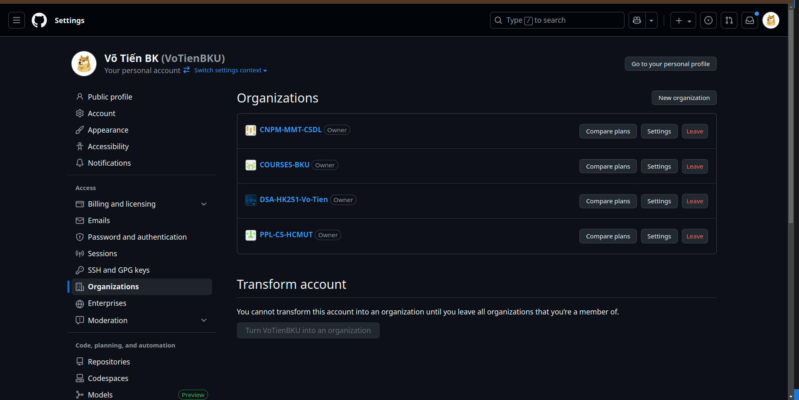
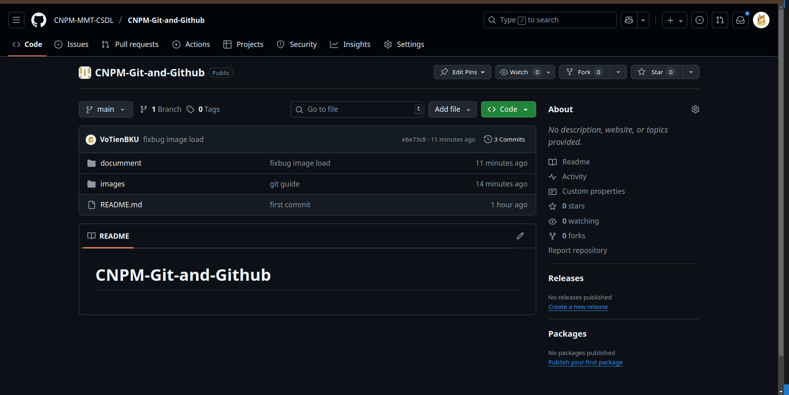
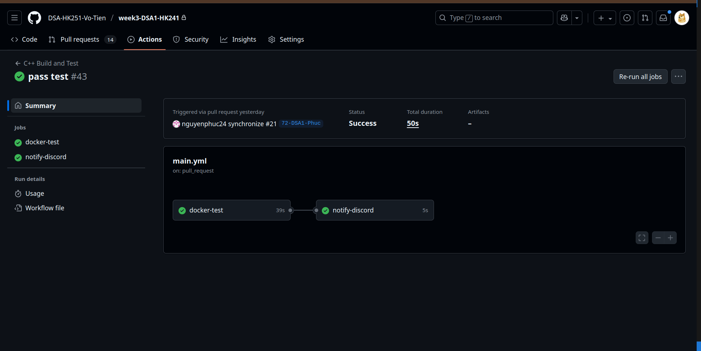

## 1. Organizations (Tổ chức trên GitHub)

### Organization là gì?
- Giúp quản lý nhiều repo và thành viên trong 1 nhóm (công ty, lớp học, team).  
- Có thể phân quyền: *Owner, Admin, Member, Outside Collaborator*.  

### Cách tạo Organization
1. Vào [GitHub → Your organizations](https://github.com/settings/organizations).  
2. Nhấn **New Organization**.  
3. Chọn gói miễn phí hoặc trả phí.  
4. Điền tên, email, tạo org.  

### Thêm thành viên
- Vào **Settings → People → Invite member**.  
- Chọn role: *Owner / Member*.  



---

## 2. Repository (Kho mã nguồn)

### Repository là gì?
- Nơi lưu trữ toàn bộ code, issue, pull request, release.  
- Có thể để **public** (ai cũng xem được) hoặc **private** (chỉ thành viên được mời).  

### Tạo repository
1. Vào [GitHub → New Repository](https://github.com/new).  
2. Đặt tên repo → chọn public/private.  
3. Chọn init với README (tùy).  
4. Nhấn **Create Repository**.  

### Thêm thành viên
- Vào repo → **Settings → Collaborators → Add people**.  
- Nhập username/email GitHub → chọn quyền (*Read, Triage, Write, Maintain, Admin*).  



---

## 3. GitHub Actions (CI/CD)

### GitHub Actions là gì?
- Hệ thống **CI/CD** (Continuous Integration / Continuous Deployment) tích hợp sẵn trên GitHub.  
- Cho phép chạy **workflow** (chuỗi công việc) mỗi khi có sự kiện (push code, mở PR, tạo release...).  

### Ví dụ CI/CD cơ bản
Tạo file `.github/workflows/ci.yml` trong repo:  
```yml
    name: CI Example
    on:
      push:
        branches: [ "main" ]
      pull_request:
        branches: [ "main" ]

    jobs:
      build:
        runs-on: ubuntu-latest
        steps:
          - uses: actions/checkout@v3
          - name: Setup Node.js
            uses: actions/setup-node@v3
            with:
              node-version: "18"
          - run: npm install
          - run: npm test
```
### Giải thích
- **on**: định nghĩa trigger (ở đây là push/pull vào `main`).  
- **jobs**: tập hợp các bước cần chạy.  
- **steps**: checkout code → setup môi trường → cài package → chạy test.  



---

# 4.Hướng Dẫn Tạo GitHub Profile Xịn Xò  

GitHub cho phép bạn tạo một **Profile README đặc biệt** hiển thị ngay tại trang cá nhân (ví dụ: https://github.com/username).  
README này có thể chứa **giới thiệu bản thân, hình ảnh, badge, stats, project nổi bật**.  

---

## 📌 1. Tạo Profile Repository  

1. Đăng nhập vào [GitHub](https://github.com).  
2. Nhấn nút **New Repository**.  
3. **Tên repository phải trùng với username của bạn**.  
   - Ví dụ: username của bạn là `votienbku` → repo tên là **`votienbku`**.  
4. Chọn **Public**.  
5. Tick vào **Add a README file**.  
6. Nhấn **Create repository**.  

👉 Vậy là bạn đã có repo đặc biệt cho Profile. File `README.md` trong repo này sẽ hiển thị ngay trang cá nhân.  

---

## 📌 2. Chỉnh sửa README.md  

Bạn có thể chỉnh sửa `README.md` để giới thiệu bản thân.  

```markdown
# 👋 Xin chào, mình là Võ Tiến  

🎓 Sinh viên HCMUT | 💻 Yêu thích Lập trình & AI  

- 🔭 Hiện đang làm: StudyHubBKU 🚀  
- 🌱 Đang học: React, Node.js, Data Structures & Algorithms  
- 🎯 Mục tiêu: Fullstack Developer & AI Engineer  
- 📫 Liên hệ: [Facebook](https://facebook.com/...) | [LinkedIn](https://linkedin.com/in/...)
```